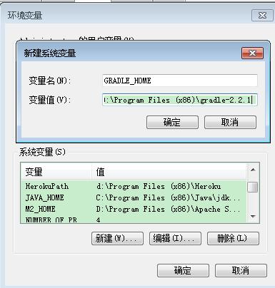
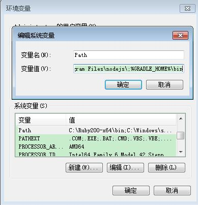
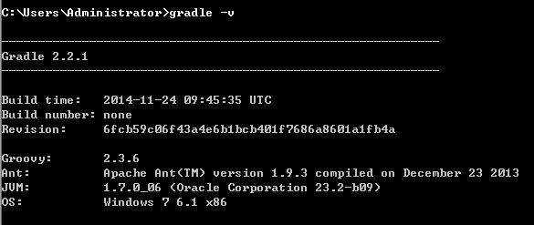

# 安装

## 前置条件

Gradle 需要 Java JDK 或者 JRE，版本是 6 及以上。Gradle 将会装载自己的 Groovy 库，因此，Groovy 不需要被安装。任何存在的 Groovy 安装都会被 Gradle 忽略。

Gradle 使用你 path 中的 JDK,或者，您可以设置 java_home 环境变量来指向所需的 JDK 安装目录。

## 下载

[下载](http://www.gradle.org/downloads) Gradle 的发布包.

## 解压

Gradle 的发布包被打包成 ZIP。完整的发布包含:

- Gradle 二进制
- 用户指南 (HTML 和 PDF)
- DSL 参考指南
- API 文档(Javadoc 和 Groovydoc)
- 扩展示例，包括用户指南中引用的例子，以及一些完整的和更复杂的构建可以作为自己开始的构建。
- 二进制源文件。这是只供参考。如果你想编译 Gradle 你需要下载源发布包或从源库资源中检出。请参阅[网站](http://www.gradle.org/development) 

## 环境变量

添加 `GRADLE_HOME/bin` 到你的 path 环境变量

## 运行和测试安装

通过 `gradle` 命令运行 Gradle。`gradle -v` 用来查看安装是否成功。输出 	Gradle 的版本信息和本地变量配置信息	 (Groovy, JVM version, OS, 等)。Gradle 显示的版本信息应该和你下载的匹配

## 虚拟机选项

虚拟机选项可以设置 Gradle 的运行环境变量。可以使用   GRADLE_OPTS 或者 JAVA_OPTS，或者两个都选。 JAVA_OPTS 约定和 java 共享环境变量。典型的案例是在 JAVA_OPTS 设置 HTTP 代理，在 GRADLE_OPTS 设置内存。这些变量也可在`gradle` 或者 `gradlew` 脚本开始时设置
 
注意：目前无法在命令行工具为 Gradle 设置 JVM 选项